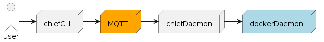
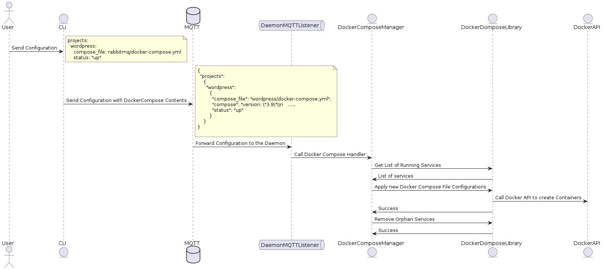

# Container chief
A MQTT listener that spins up containers based on configuration messages.

## Architecture



## Getting started

Start MQTT broker:

`docker run -d --name emqx -p 18083:18083 -p 1883:1883 emqx/emqx:latest`

Start Chief Daemon:

`go run cmd/chiefd/daemon.go`

Send a message to the daemon:

`go run cmd/chief/client.go -i examples/wordpress.yaml -d device1`


## Messages

Messages are composed of a list of services and it's corresponding docker-compose content.

For example, the CLI would convert an input file like this:

```
projects: 
  wordpress:
    compose_file: rabbitmq/docker-compose.yml
    status: "up"
```

Into this:

```
projects: 
  rabbitmq:
    status: "up"
    compose: 
      version: "3.2"
      services:
          rabbitmq:
            image: rabbitmq:3-management-alpine
            container_name: 'rabbitmq'
            ports:
              - 5672:5672
              - 15672:15672
            volumes:
              - ~/.docker-conf/rabbitmq/data/:/var/lib/rabbitmq/
              - ~/.docker-conf/rabbitmq/log/:/var/log/rabbitmq
            networks:
              - rabbitmq_go_net

        networks:
          rabbitmq_go_net:
            driver: bridge
```


And finally the CLI would send this message to the MQTT broker using the following topic:

`chief/devices/<device_id>/configurations`


An events diagram would look like this:

